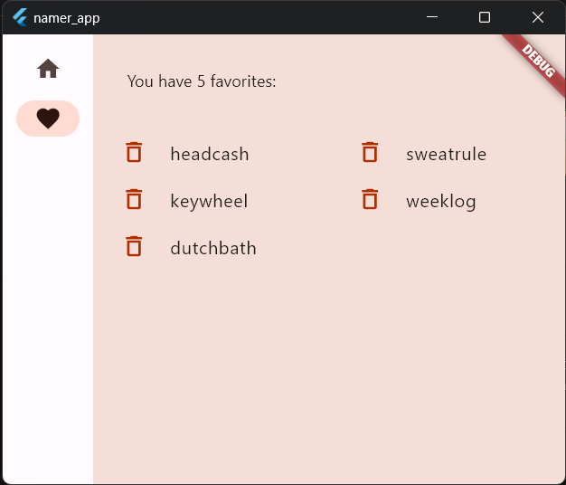

# NamerApp - A Creative Name Generator App

NamerApp is a fun and interactive Flutter application that generates creative and unique names. Whether you're looking for a cool username, a name for your new project, or just some naming inspiration, NamerApp has you covered.

## Features

- **Name Generation**: Get cool and unique name suggestions with a simple tap.
- **Favorite Names**: Like a name? Save it to your favorites for future reference.
- **Review Favorites**: Easily review and manage your list of favorited names on a separate page.
- **Responsive Design**: CoolNamer is designed to adapt to different screen sizes, providing a seamless user experience on various devices.

## Screenshots

## Installation

To run NamerApp on your local machine, follow these steps:

1. Clone this repository: `git clone https://github.com/yourusername/coolnamer.git`
2. Navigate to the project directory: `cd namerapp`
3. Install dependencies: `flutter pub get`
4. Run the app: `flutter run`

## License

This project is licensed under the MIT License - see the [LICENSE](LICENSE) file for details.

## Acknowledgments

NamerApp is inspired by the Flutter Codelab: "Write Your First Flutter App" and is created as a fun and educational project.

